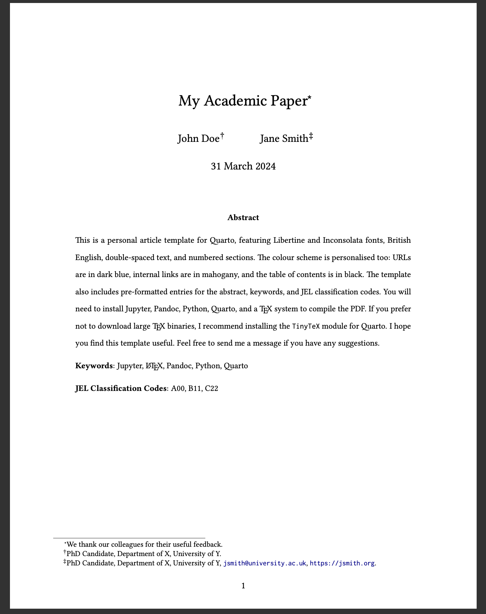

# Quarto templates

A collection of personal [Quarto](https://quarto.org) PDF templates. They share a common style: [Libertine](https://libertine-fonts.org/) and [Inconsolata](https://fonts.google.com/specimen/Inconsolata) fonts, British English spelling, coloured links, and clean formatting throughout.

## Templates

| Template | Description | Main files |
|----------|-------------|------------|
| [article](article/) | Academic article with numbered sections, double spacing, and back references | `article.qmd`, `article-template.latex` |
| [cv](cv/) | Curriculum vitae | `cv.qmd`, `cv-template.latex` |
| [letter](letter/) | Formal letter with optional letterhead and signature images | `letter.qmd`, `letter-template.latex` |
| [syllabus](syllabus/) | Course syllabus | `syllabus.qmd`, `syllabus-template.latex` |
| [title-page](title-page/) | Article with a separate title page | `title-page.qmd`, `title-page-template.latex` |

Each folder contains a rendered PDF showing the template output.

## Requirements

- [Quarto](https://quarto.org/docs/get-started/) (v1.3 or later)
- A LaTeX distribution: [TinyTeX](https://quarto.org/docs/output-formats/pdf-engine.html) (recommended) or [TeX Live](https://tug.org/texlive/)
- [Python](https://www.python.org/downloads/) and [Jupyter](https://jupyter.org/install) (for the default `jupyter: python3` kernel)

R users should remove the `jupyter: python3` line from the YAML header and install the [`quarto-r`](https://quarto-dev.github.io/quarto-r/) and [`rmarkdown`](https://rmarkdown.rstudio.com/lesson-1.html) packages instead.

## Usage

Clone the repository and render any template with:

```bash
git clone https://github.com/danilofreire/quarto-templates.git
cd quarto-templates/article
quarto render article.qmd --to pdf
```

Edit the `.qmd` file to change content, and adjust the YAML header to modify formatting options (fonts, spacing, margins, colours, etc.). Each template uses a custom `.latex` file that controls the PDF layout.

### Letter template options

The letter template supports several optional YAML fields for letterhead and signature images:

```yaml
letterhead: emory.png          # path to letterhead image
letterhead-width: 7cm          # image width
letterhead-xshift: 1.7cm       # horizontal offset from page edge
letterhead-yshift: 1.8cm       # vertical offset from page edge
signature: /path/to/sig.png    # path to signature image
signature-width: 5cm            # signature image width
signature-hshift: -0.3cm       # horizontal shift (negative = left)
```

All of these are optional. If omitted, the letter renders without a letterhead or signature.

## Screenshot



## Licence

Feel free to use and adapt these templates. If you find them useful, consider starring the repository. Comments, issues, and pull requests are welcome.
