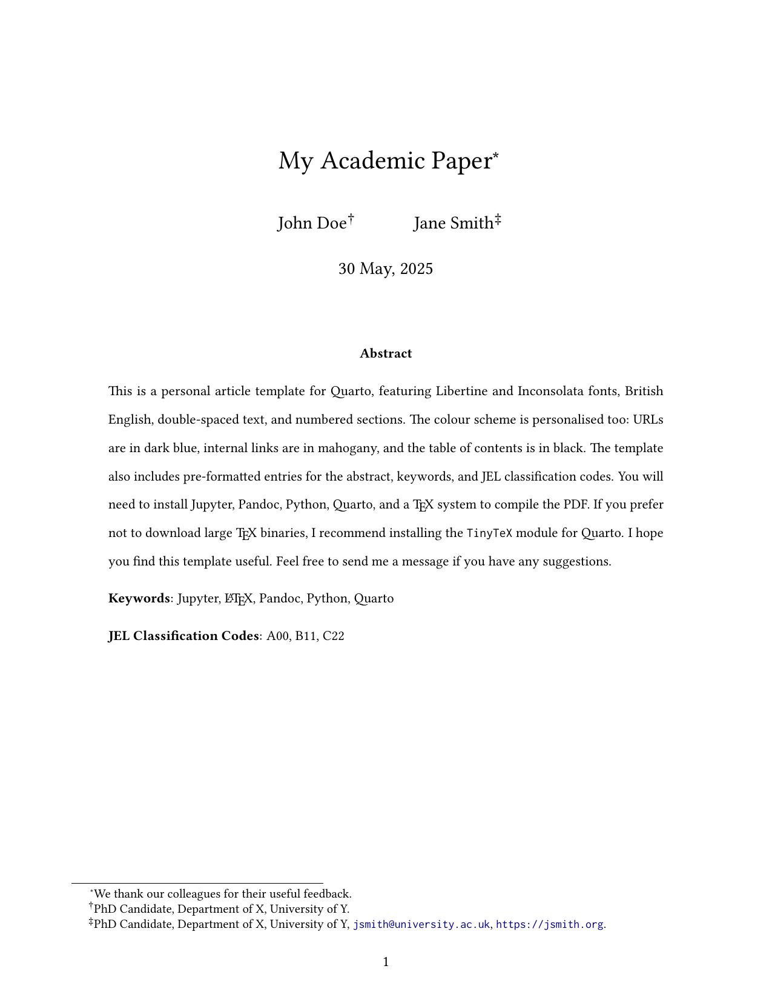
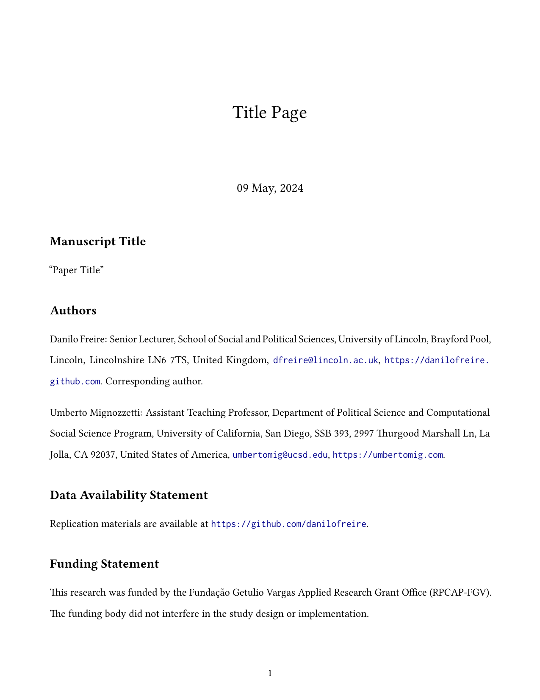
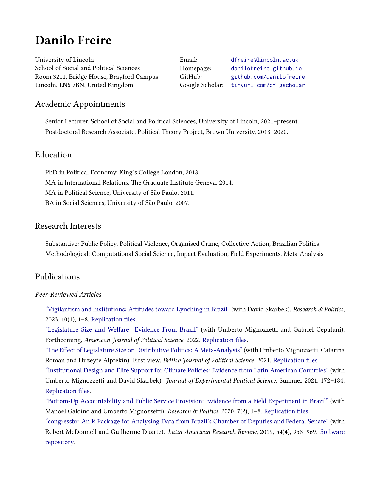
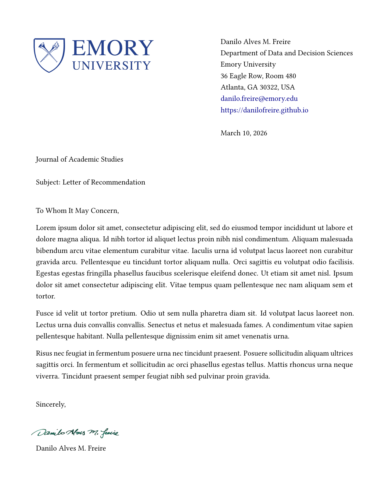
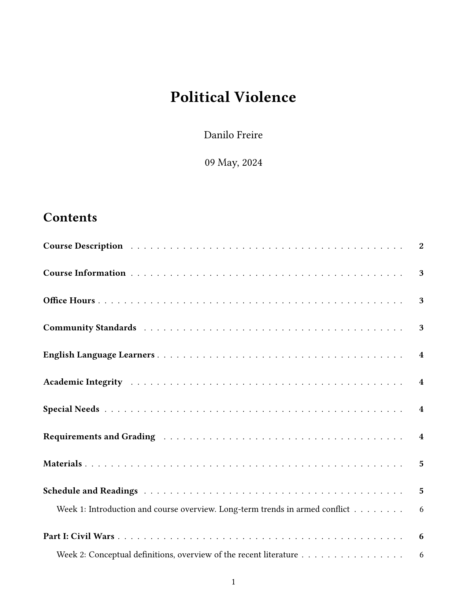

::: {.column-screen}
```{=html}
<div class="hero">
  <div class="hero-inner">
    <div class="hero-title">Quarto templates</div>
    <p class="lead">A small collection of personal PDF templates for Quarto. They share one clean style: Libertine and Inconsolata fonts, British English spelling, coloured links, and generous margins.</p>
    <div class="badges">
      <span class="badge-pill">Libertine + Inconsolata</span>
      <span class="badge-pill">British English</span>
      <span class="badge-pill">pdflatex</span>
      <span class="badge-pill">5 templates</span>
    </div>
    <div class="hero-actions">
      <a class="btn-hero primary" href="#templates">Browse the templates</a>
      <a class="btn-hero ghost" href="https://github.com/danilofreire/quarto-templates">View on GitHub</a>
    </div>
  </div>
</div>
```
:::

::: {.section-head}
## The templates {#templates}

Each template is a single `.qmd` file with a matching LaTeX layout. Click any preview to open the rendered PDF.
:::

```{=html}
<div class="template-grid">

  <article class="template-card">
    <a class="thumb" href="article/article.pdf" aria-label="Open the article PDF">
      
    </a>
    <div class="card-body">
      <h3>Article</h3>
      <p>Academic article with numbered sections, double spacing, an abstract, keywords, JEL codes, and back references.</p>
      <div class="card-links">
        <a class="view" href="article/article.pdf">View PDF</a>
        <a class="src" href="https://github.com/danilofreire/quarto-templates/tree/main/article">Source</a>
      </div>
    </div>
  </article>

  <article class="template-card">
    <a class="thumb" href="title-page/title-page.pdf" aria-label="Open the title-page PDF">
      
    </a>
    <div class="card-body">
      <h3>Title page</h3>
      <p>The article layout with a separate, formatted title page for the author, abstract, and affiliation details.</p>
      <div class="card-links">
        <a class="view" href="title-page/title-page.pdf">View PDF</a>
        <a class="src" href="https://github.com/danilofreire/quarto-templates/tree/main/title-page">Source</a>
      </div>
    </div>
  </article>

  <article class="template-card">
    <a class="thumb" href="cv/cv.pdf" aria-label="Open the CV PDF">
      
    </a>
    <div class="card-body">
      <h3>CV</h3>
      <p>A curriculum vitae with clear section headings, aligned dates, and the same typographic style as the rest.</p>
      <div class="card-links">
        <a class="view" href="cv/cv.pdf">View PDF</a>
        <a class="src" href="https://github.com/danilofreire/quarto-templates/tree/main/cv">Source</a>
      </div>
    </div>
  </article>

  <article class="template-card">
    <a class="thumb" href="letter/letter.pdf" aria-label="Open the letter PDF">
      
    </a>
    <div class="card-body">
      <h3>Letter</h3>
      <p>A formal letter with optional letterhead and signature images, set through a few simple YAML fields.</p>
      <div class="card-links">
        <a class="view" href="letter/letter.pdf">View PDF</a>
        <a class="src" href="https://github.com/danilofreire/quarto-templates/tree/main/letter">Source</a>
      </div>
    </div>
  </article>

  <article class="template-card">
    <a class="thumb" href="syllabus/syllabus.pdf" aria-label="Open the syllabus PDF">
      
    </a>
    <div class="card-body">
      <h3>Syllabus</h3>
      <p>A course syllabus with room for a schedule, readings, and policy sections, ready to adapt to any class.</p>
      <div class="card-links">
        <a class="view" href="syllabus/syllabus.pdf">View PDF</a>
        <a class="src" href="https://github.com/danilofreire/quarto-templates/tree/main/syllabus">Source</a>
      </div>
    </div>
  </article>

</div>
```

::: {.section-head}
## One shared style
:::

```{=html}
<div class="feature-grid">
  <div class="feature">
    <div class="ico">Aa</div>
    <h3>Libertine + Inconsolata</h3>
    <p>A warm serif for the body and a readable mono for code, used across every template.</p>
  </div>
  <div class="feature">
    <div class="ico">EN</div>
    <h3>British English</h3>
    <p>Spelling, hyphenation, and date formats all set to <code>lang: en-GB</code> by default. Prefer American English? Just change it to <code>lang: en-US</code>.</p>
  </div>
  <div class="feature">
    <div class="ico">↗</div>
    <h3>Coloured links</h3>
    <p>Dark-blue URLs and mahogany internal links and citations, easy to change in the YAML.</p>
  </div>
  <div class="feature">
    <div class="ico">PDF</div>
    <h3>Render with pdflatex</h3>
    <p>Built for a standard LaTeX toolchain, and light enough to use TinyTeX.</p>
  </div>
</div>
```

::: {.section-head}
## Installation {#install}

You need Quarto, a LaTeX distribution, and (for the default kernel) Python with Jupyter.
:::

- [Quarto](https://quarto.org/docs/get-started/), version 1.3 or later
- A LaTeX distribution: [TinyTeX](https://quarto.org/docs/output-formats/pdf-engine.html) (recommended) or [TeX Live](https://tug.org/texlive/)
- [Python](https://www.python.org/downloads/) and [Jupyter](https://jupyter.org/install), for the default `jupyter: python3` kernel

Prefer R? You can switch the kernel in one step: delete the `jupyter: python3` line from the YAML header (that line is what tells Quarto to use Python), then install the [`quarto-r`](https://quarto-dev.github.io/quarto-r/) and [`rmarkdown`](https://rmarkdown.rstudio.com/lesson-1.html) packages. Quarto then renders the template with R, and you do not need Python or Jupyter at all.

::: {.section-head}
## Usage {#usage}

Clone the repository and render any template you like.
:::

```bash
git clone https://github.com/danilofreire/quarto-templates.git
cd quarto-templates/article
quarto render article.qmd --to pdf
```

Edit the `.qmd` file to change the content, and adjust the YAML header to change the formatting (fonts, spacing, margins, colours). Each template carries its own `.latex` file that controls the PDF layout.

The letter template adds a few optional fields for a letterhead and a signature image:

```yaml
letterhead: emory.png          # path to letterhead image
letterhead-width: 7cm          # image width
signature: /path/to/sig.png    # path to signature image
signature-width: 5cm           # signature image width
```

All of these are optional. Leave them out and the letter renders with neither a letterhead nor a signature.

The templates are free to use and adapt. If you find them helpful, consider [starring the repository](https://github.com/danilofreire/quarto-templates); comments, issues, and pull requests are welcome
